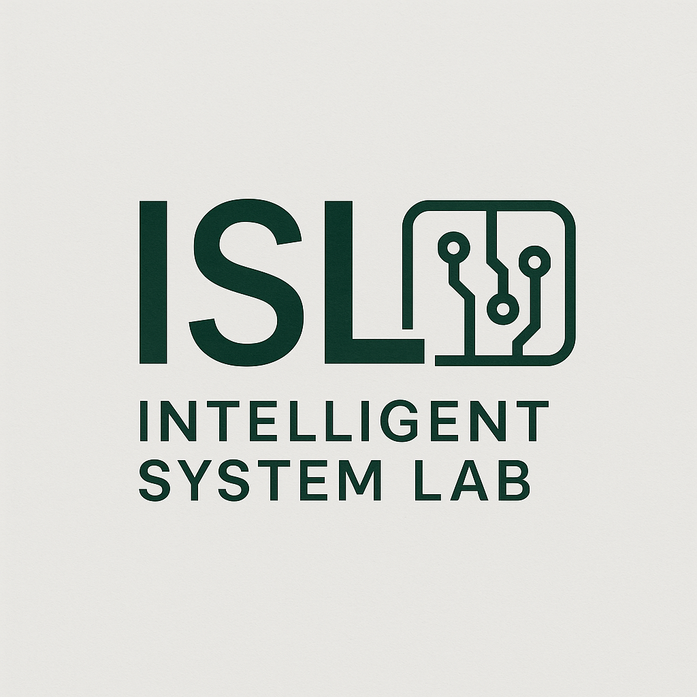
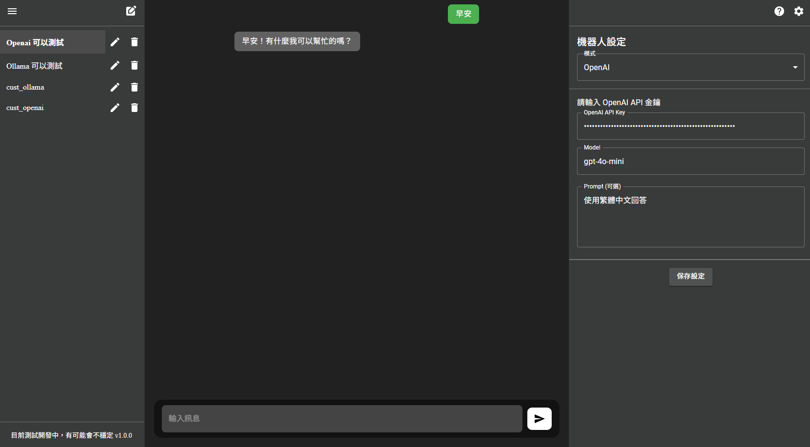

<div align="center">
  
</div>

# NYCU Intelligent System Lab Chat Interface

這是一個簡單的聊天介面，設計用於與多種模型進行互動。
除了與模型聊天外，還可以作為自訂 API 請求產生器，提供一個簡單的互動介面。
此專案主要是為 NYCU Intelligent System Lab 開發，並且是 open source 。

<div align="center">
  
</div>

## 技術架構

- **前端**: React, Vite
- **後端**: FastAPI, Poetry
- **資料庫**: MongoDB

## 功能特色

- 支援多種聊天模式（如 OpenAI、Ollama、自訂 API）。
- 每個聊天 Session 可獨立調整設定內容。
- 提供自訂 API 請求功能，方便進行簡單的互動測試。

## 啟動方法

1. **修改環境設定檔**  
   將 `.env copy` 的內容修改為正確的設定，並將檔名改為 `.env`。

2. **啟動專案**  
   使用以下指令啟動專案：
   ```bash
   docker-compose up

## 未來功能

以下是目前尚未支援的功能，歡迎有興趣的開發者進行貢獻：

- **對話紀錄保存**: 目前資料庫未保存對話紀錄，重新整理頁面會清空所有內容。
- **Stream 互動方式**: 現在僅支援非 Stream 的互動方式，未來將增加 Stream 支援。
- **多種 API 請求方式**: 目前僅支援 REST API，未來將新增其他種類的 API 請求方式。
- **UI 改善**: 現有介面較簡單，還有許多內容可以進行優化。
- **Session Name 儲存優化**: 修改 Session Name 後仍需在設定中保存，未來將改善此流程。
- **多語言支援**: 增加英文版本，並提供語言切換功能。

## License

本專案採用 [MIT License](./LICENSE)。  
詳細內容請參閱 `LICENSE` 文件。